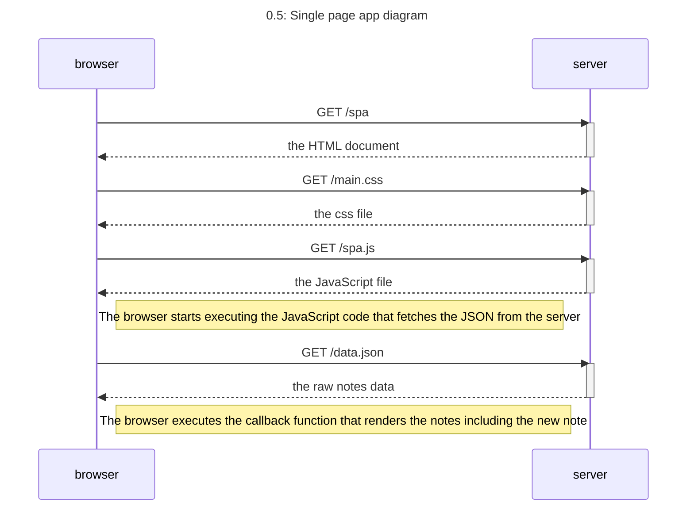

```mermaid
sequenceDiagram
Title: 0.5: Single page app diagram

    participant browser
    participant server

    browser->>server: GET /spa
    activate server
    server-->>browser: the HTML document
    deactivate server

    browser->>server: GET /main.css
    activate server
    server-->>browser: the css file
    deactivate server

    browser->>server: GET /spa.js
    activate server
    server-->>browser: the JavaScript file
    deactivate server

    Note right of browser: The browser starts executing the JavaScript code that fetches the JSON from the server

    browser->>server: GET /data.json
    activate server
    server-->>browser: the raw notes data
    deactivate server

    Note right of browser: The browser executes the callback function that renders the notes including the new note

```
