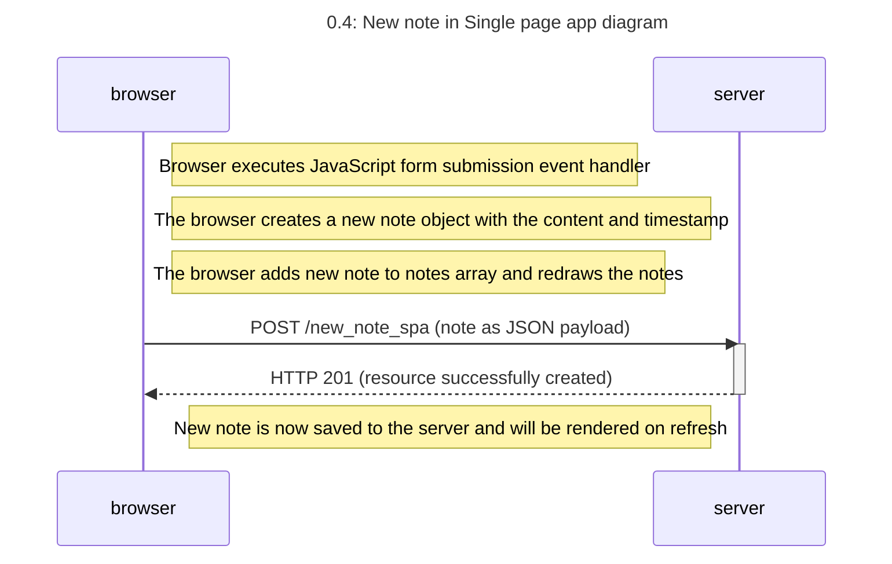

```mermaid
sequenceDiagram
Title: 0.4: New note in Single page app diagram

    participant browser
    participant server

    Note right of browser: Browser executes JavaScript form submission event handler 
    Note right of browser: The browser creates a new note object with the content and timestamp
    Note right of browser: The browser adds new note to notes array and redraws the notes

    browser->>server: POST /new_note_spa (note as JSON payload)
    activate server
    server-->>browser: HTTP 201 (resource successfully created)
    deactivate server

    Note left of server: New note is now saved to the server and will be rendered on refresh 

```
